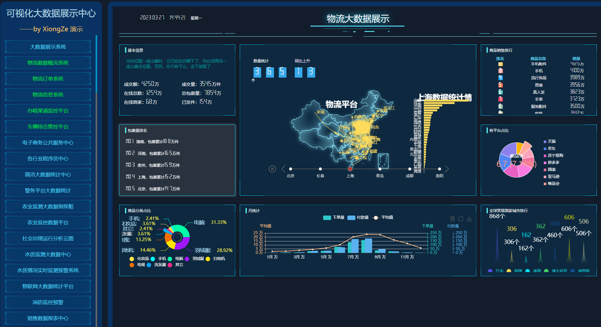

# 持续更新中（75+24套）：数据可视化集合。 

#### 介绍
基于HTML/CSS/Echarts的会议展览、业务监控、风险预警、数据分析展示等多种展示需求可视化集合。

所有模板都是收集网络的，特别感谢：熊泽gitee的开源项目！

演示地址：
 **https://gpt-888.github.io/dashboards/** 

#### 应用方式
使用[smartchart](https://gitee.com/smartchart/smartchart)进行模板转化

